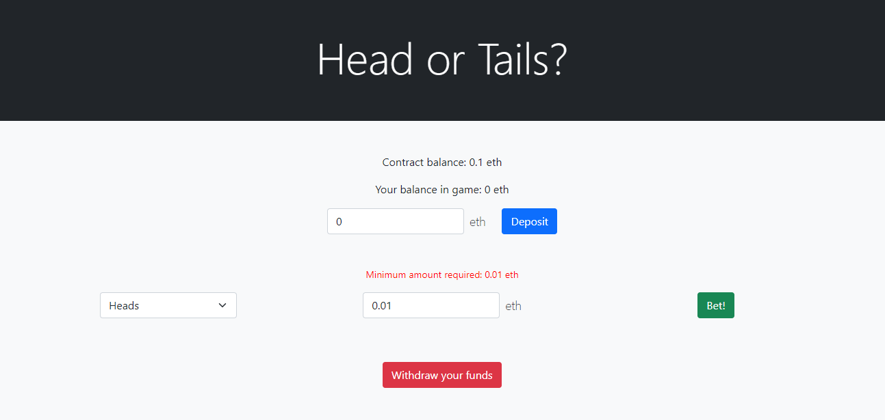

[](https://forthebadge.com)

# CoinFlip Betting DApp

CoinFlip DApp is a decentralized application where a player can bet on the result of a coin flip. In order to achieve almost 100% randomness in the coinflip, the project cooperates with an off-chain oracle, which sends back the result calling a callback function present inside the contract.
Thanks to **Ivan On Tech Blockchain Academy** for the awesome course on https://academy.ivanontech.com/

## Setup 

### Requirements

- Install [Truffle](https://www.trufflesuite.com/docs/truffle/getting-started/installation)
    ```
    npm install -g truffle
    ```
- Make sure to add a new file in the root folder named *.secret* where you can paste the seed phrase of your metamask wallet
- If you don't have it yet (you should), install python
- Install Metamask 
- Register on infura.io to communicate with the oracle.
    * Create a new project
    * Select "Endpoint Ropsten" and paste it inside ./truffle-config.js, where HDWalletProvider is initialized
- Get some Ether for testing your DApp from https://faucet.metamask.io/

### Additional installations 

For unit testing I recommend you to install **truffle-assertions** via npm.
Initialize node package manager first, then install the package as a dependency.
```
npm init
npm install truffle-assertions
```

### Deploy Smart Contract

- Open a shell and type ```truffle migrate --reset --network ropsten```

### Launch DApp

- Wait until the contract has been successfully deployed, then copy the contract address (it's in the shell where you deployed it) and replace it with the address present in ./frontend/main.js (at the line where contractInstance is initialized)
- Go inside ./build/CoinFlip.json and copy **abi** object. Replace it inside ./frontend/abi.js
- Type the following command, in order to launch a local web server (if you don't do it, web3 won't function)
    ```
    pyton -m http.server
    or 
    pyton -m SimpleHTTPServer
    ```

## Preview

Note that frontend is just a basic one, created to interact with the contract. Further implementations will consider it as well, but I wanted to focus more on the contract development.



## Contributing
Pull requests are welcome. For major changes, please open an issue first to discuss what you would like to change.
